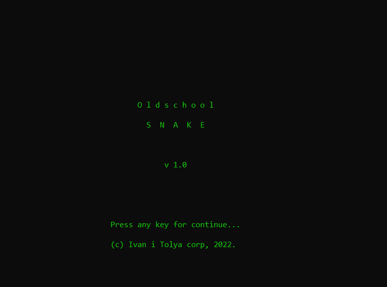
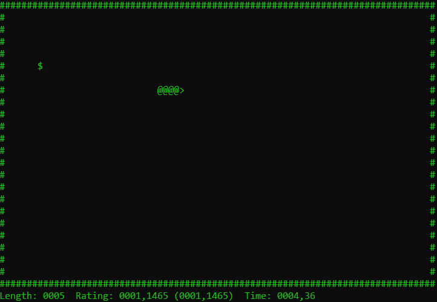
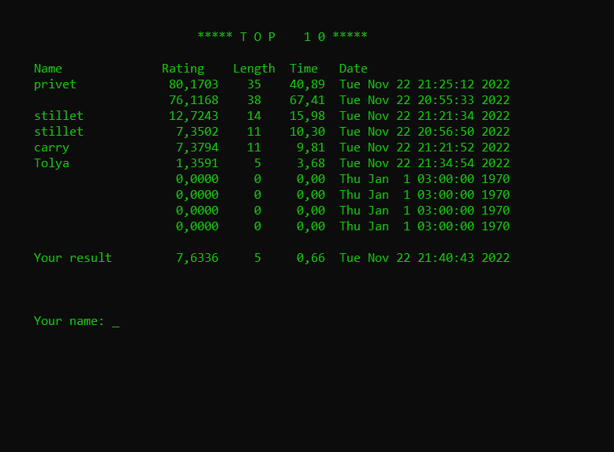

# Требования к проекту
---

# Содержание
1 [Введение](#intro)  
1.1 [Назначение](#appointment)  
1.2 [Бизнес-требования](#business_requirements)  
1.2.1 [Исходные данные](#initial_data)  
1.2.2 [Возможности бизнеса](#business_opportunities)  
1.2.3 [Границы проекта](#project_boundary)  
1.3 [Аналоги](#analogues)  
1.3.1 [Snake®](#Snake®)  
1.3.2 [Snake lll](#Snake_lll)  
2 [Требования пользователя](#user_requirements)  
2.1 [Программные интерфейсы](#software_interfaces)  
2.2 [Интерфейс пользователя](#user_interface)  
2.3 [Характеристики пользователей](#user_specifications)  
2.3.1 [Классы пользователей](#user_classes)  
2.3.2 [Аудитория приложения](#application_audience)  
2.3.2.1 [Целевая аудитория](#target_audience)  
2.3.2.1 [Побочная аудитория](#collateral_audience)  
2.4 [Предположения и зависимости](#assumptions_and_dependencies)  
3 [Системные требования](#system_requirements)  
3.1 [Функциональные требования](#functional_requirements)  
3.1.1 [Основные функции](#main_functions)  
3.1.1.1 [Игровой процесс](#game_proccess)  
3.1.1.2 [Начисление очков](#score_add)  
3.1.1.3 [Cохранение очков](#score_save)    
3.1.2 [Ограничения и исключения](#restrictions_and_exclusions)  
3.2 [Нефункциональные требования](#non-functional_requirements)  
3.2.1 [Атрибуты качества](#quality_attributes)  
3.2.1.1 [Требования к удобству использования](#requirements_for_ease_of_use)  
3.2.1.2 [Требования к безопасности](#security_requirements)  
3.2.2 [Внешние интерфейсы](#external_interfaces)  
3.2.3 [Ограничения](#restrictions)  

<a name="intro"/>

# 1 Введение

<a name="appointment"/>

## 1.1 Назначение
Документ разработан для однозначной трактовки требований между разработчиком и заказчиком. Необходимо разработать игровое приложение "Змейка" с низкой требовательностью к производительности ПК. В этом документе описаны функциональные и нефункциональные требования к разрабатываемой игре для ОС Windows. Этот документ предназначен для команды, которая будет реализовывать и проверять корректность работы приложения.

<a name="business_requirements"/>

## 1.2 Бизнес-требования

<a name="initial_data"/>

### 1.2.1 Исходные данные
На сегодняшний день существо огромное количество игр всевозможных жанров. Игровая индустрия на данный момент является одной из самых быстро развивающихся в сфере информационных технологий. Игра "Змейка" все еще не утратила свою популярность, в неё до сих пор играют миллионы людей.

<a name="business_opportunities"/>

### 1.2.2 Возможности бизнеса
Огромное количество людей практически любой возрастной категории проводят свое свободное время, играя в различного рода игры. Змейка - это популярная игра, которая позволяет развлечься, не тратя при этом множество часов. При разработке интерфейс должен быть спроектирован минималистично, т.к. сейчас минимализм стал одной из самых распространенных тенденций в веб-дизайне, дизайне мобильных и десктопных приложений. Простота эквивалентна удобству. Данная игра должна являться простой в освоении и интуитивно понятной в управлении, что всегда приветствуется пользователями, а также она должна иметь низкие системные требования.

<a name="project_boundary"/>

### 1.2.3 Границы проекта
Игра должна иметь графический интерфейс, для того, чтобы обеспечить взаимодействие игрока с компьютером, в ней должны быть реализованы стандартные правила игры, такие как: генерация в случайном месте "яблочек" (специальный символ, наступив на который, "Змейка вырастет в размерах"), рост, условия проигрыша , особая система начисления очков, сохранение рекордного количества очков в файле.

<a name="analogues"/>

## 1.3 Аналоги

<a name="Snake®"/>

### 1.3.1 «Snake®»
«Snake®» - одна из реализаций данной игры. Красочный дизайн игрового поля, выполненный в 2D. Быстрая динамика игрового процесса. Присутствует широкая вариация игровых режимов. Реализовано множество игровых режимов. Основные отличие от аналогов – наличие глобальной таблицы лидеров. 

<a name="Snake_lll"/>

### 1.3.2 «Snake lll»
«Snake lll» – приложение для операционной системы Android. «Snake lll» уже не является классическим аналогом игры Тетрис. Этот игровой продукт обладает продуманным до мелочей игровым процессом, простым в освоении интерфейсом и интересными правилами игры. «Snake lll» отличается большим спектром самых разнообразных настроек, начиная от внешнего вида интерфейса, игрового поля и процесса, заканчивая тонкой настройкой параметров игры.

<a name="user_requirements"/>

# 2 Требования пользователя

<a name="software_interfaces"/>

## 2.1 Программные интерфейсы
Продукт должен являться игровым приложением для OC Windows и иметь простой интерфейс пользователя. Приложение должно быть реализовано в консоли и написано на языке программирования С++. 

<a name="user_interface"/>

## 2.2 Интерфейс пользователя

<a name="start_window"/>

Стартовое окно  
  

<a name="main_window"/>

Игровое окно  
 

<a name="end_window"/>

Топ игроков  
 

<a name="user_specifications"/>

## 2.3 Характеристики пользователей

Для данного приложения не предусмотрены особые виды пользователей, т.к. он не имеет каких-либо ограничений.

<a name="user_classes"/>

### 2.3.1 Классы пользователей

| Класс пользователей | Описание |
|:---|:---|
| Обычный пользователь | Пользователи, которые могут играть в данное приложение |

<a name="application_audience"/>

### 2.3.2 Аудитория приложения
Люди любой возрастной категории, желающие провести немного времени, играя в Змейку.
<a name="target_audience"/>

#### 2.3.2.1 Целевая аудитория
Люди младшей и средней возрастной категории, которые проводят больше времени в ПК.

<a name="collateral_audience"/>

#### 2.3.2.2 Побочная аудитория
Люди любой возрастной категории, играющие в Змейку на профессиональном уровне, преследующие соревновательные цели.

<a name="assumptions_and_dependencies"/>

## 2.4 Предположения и зависимости
1. Приложение должно использовать не стандартный набор символов, а мультибайтовую строку.

<a name="system_requirements"/>

# 3 Системные требования

<a name="functional_requirements"/>

## 3.1 Функциональные требования

<a name="main_functions"/>

### 3.1.1 Основные функции

<a name="game_proccess"/>

#### 3.1.1.1 Игровой процесс
**Описание.** Для выполнения игровых операций, используются следующие клавиши клавиатуры. Все возможные действия, должны иметь запасной вариант клавиши, для обеспечения более удобного игрового процесса.

| Клавиша | Выполняемая функция | 
|:---|:---|
| W/Up | Поворот змейки вверх или продолжение движения вверх |
| A/Left | Поворот змейки налево или продолжение движения вверх |
| D/Right | Поворот змейки направо или продолжение движения вверх |
| S/Down | Поворот змейки вниз или продолжение движения вверх |

<a name="score_add"/>

#### 3.1.1.2 Начисление очков.
**Описание.** Очки должны начисляться особым образом.  
**Требования.** Очки должны начисляться в зависимости не только от сьеденного "яблочка", но и от частоты их поедания.

<a name="score_save"/>

#### 3.1.1.3 Сохранение очков.
**Описание.** Рекордное количество очков должно сохраньтся, при последующих игровых сеансах.  

### 3.1.2 Ограничения и исключения
1. Приложение выполняет весь функционал без наличия подключения к Интернету;

<a name="non-functional_requirements"/>

## 3.2 Нефункциональные требования

<a name="quality_attributes"/>

### 3.2.1 Атрибуты качества

<a name="requirements_for_ease_of_use"/>

#### 3.2.1.1 Требования к удобству использования
1. Понятность в управлении приложением используя клавиатуру;
2. Интуитивно понятный интерфейс.
3. Быстрый отклик приложения.

<a name="security_requirements"/>

#### 3.2.1.2 Требования к безопасности
Данное приложение является полностью безопасным, т.к. оно не собирает какую-либо информацию о пользователе и не имеет доступа в Интернет.

<a name="external_interfaces"/>

### 3.2.2 Внешние интерфейсы
Окна приложения удобны для использования пользователями с плохим зрением:
  * Крупный размер шрифта (не менее 14пт);
  * Приятное сочетание цветов.

<a name="restrictions"/>

### 3.2.3 Ограничения
1. Приложение должно быть реализовано на языке C++14(либо выше);
2. Приложение должно использовать стандартные библиотеки с++, для обеспечения графческого интерфейса в консоли;
3. Приложение должно стабильно работать на Windows 7/10/11.
